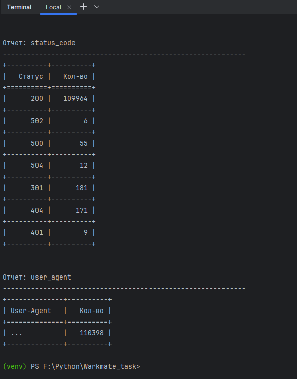

# Задание для Workmate

## Примеры запуска скриптов

## Запуск тестов

## Проверка линтера

## Примеры команд
### Команды отчетов
- python main.py --file example1.log --report average
- python main.py --file example1.log --report average --date 2025-06-22
- python main.py --file example1.log --report average --date 2021-01-01
- python main.py --file example2.log --report average
- python main.py --file example2.log --report average --date 2025-06-22
- python main.py --file example2.log --report average --date 2021-01-01
- python main.py --file example1.log example2.log --report average
- python main.py --file example1.log example2.log --report average --date 2025-06-22
- python main.py --file example1.log example2.log --report average --date 2021-01-01

- python main.py --file example1.log --report user_agent

- python main.py --file example2.log --report status_code --date 2025-06-22

- python main.py --file example2.log --report all

### Команды тестов
- python -m pytest tests/ -v

- python -m pytest tests/test_main.py -v
- python -m pytest tests/test_log_parser.py -v
- python -m pytest tests/test_reports.py -v

